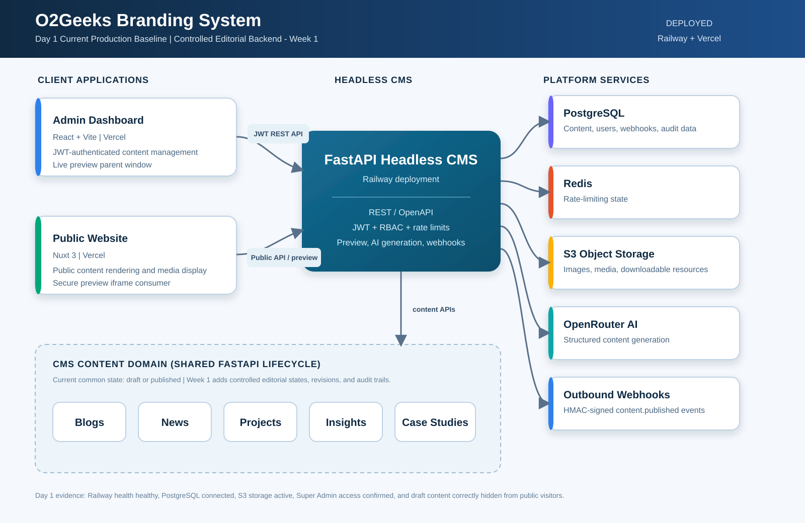

# Day 1 Architecture Diagram — Current Baseline

This SVG diagram shows the deployed Admin Dashboard and Public Website on Vercel, the FastAPI CMS on Railway, and its PostgreSQL, Redis, S3, OpenRouter AI, outbound-webhook, and five-content-type dependencies.

## Current editorial-state limitation

The shared content model currently supports a direct `draft -> published` status change. Day 2 expands this into controlled review, approval, scheduling, publication, unpublication, and archival transitions.
