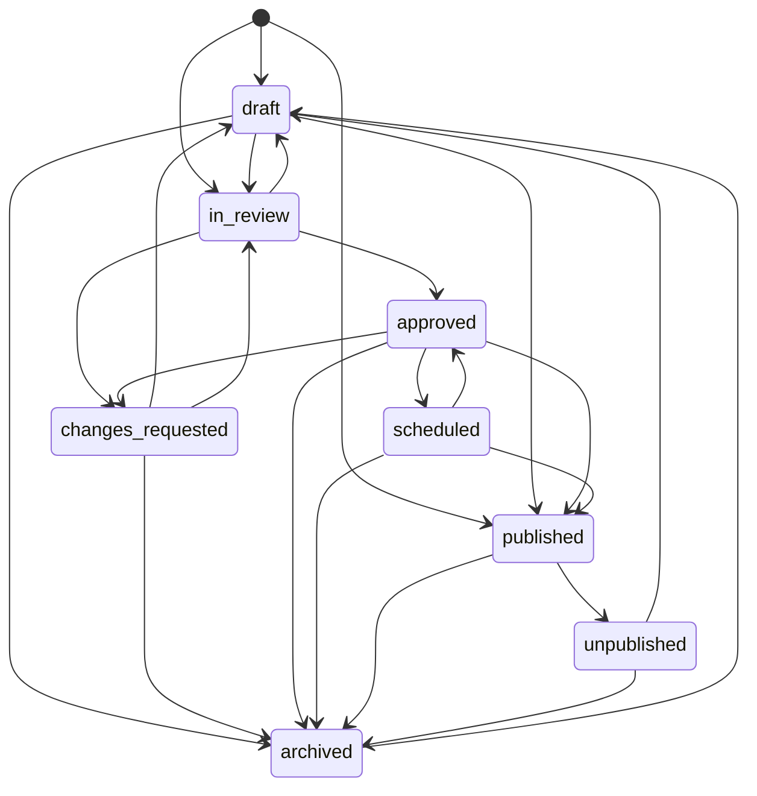

# Day 2 Lifecycle Model - Complete

**Date:** 2026-08-04  
**Scope:** Controlled editorial state validation for Blog, News, Project, Insight, and Case Study.

**Planning note:** This work was implemented early while resolving Day 1 findings and is now fully backed by database fields. Day 2 is complete because the lifecycle workflow, permissions, and evidence columns are implemented together.

## Lifecycle States

All five content types now share the same `ContentStatus` enum:

| State | Meaning |
|---|---|
| `draft` | Editable internal draft |
| `in_review` | Submitted for editorial review |
| `changes_requested` | Reviewer requested revision |
| `approved` | Approved for release |
| `scheduled` | Approved and waiting for scheduled publication |
| `published` | Publicly visible |
| `unpublished` | Removed from public visibility after publication |
| `archived` | Retired from normal editorial workflow |

Only `published` remains publicly visible. Existing public listing and slug endpoints still filter to `status == "published"` unless the authenticated user can view drafts.

## Allowed Transitions



## Permission Boundary

| Target state | Required permission |
|---|---|
| `approved` | `approve` |
| `scheduled` | `publish` |
| `published` | `publish` |
| `unpublished` | `publish` |
| `archived` | `publish` |

`admin` and `super_admin` have `approve` and `publish`. Editors can create and update content, submit drafts to review, and revise content, but cannot approve, publish, unpublish, schedule, or archive content.

## Verification

Focused lifecycle tests:

```powershell
.\venv\Scripts\python.exe -m pytest tests\test_content_lifecycle.py -q
```

Result: `7 passed`.

Full regression suite:

```powershell
.\venv\Scripts\python.exe -m pytest tests -q --disable-warnings
```

Result: `50 passed, 24 warnings in 10.14s`.

## Day 2 Outcome

The workflow is complete for Day 2 because every content type now has:

- controlled state transitions
- explicit approval/publish permission checks
- a persisted timestamp for the last status change
- a persisted user id for the last status change
- a persisted reason for the last status change

That means the editorial backend can now say not only what state an item is in, but also who changed it, when, and why.

## Day 2 Follow-up

All content responses now expose `status_changed_at`, `status_changed_by_id`, and `status_change_reason`. They are `null` until a real status transition occurs; resubmitting the same status does not overwrite the existing audit evidence. The existing `PUT /api/v1/blogs/{blog_id}` remains the single blog update endpoint.

The local React admin dashboard now supports the same workflow for Blog, News, Project, Insight, and Case Study editors: all lifecycle states, permission-aware valid transition choices, an optional status-change reason, coloured state badges, and a lifecycle-details panel. The form retains existing saved values when editing, so the regular update flow continues to submit the current values alongside any changed value.
