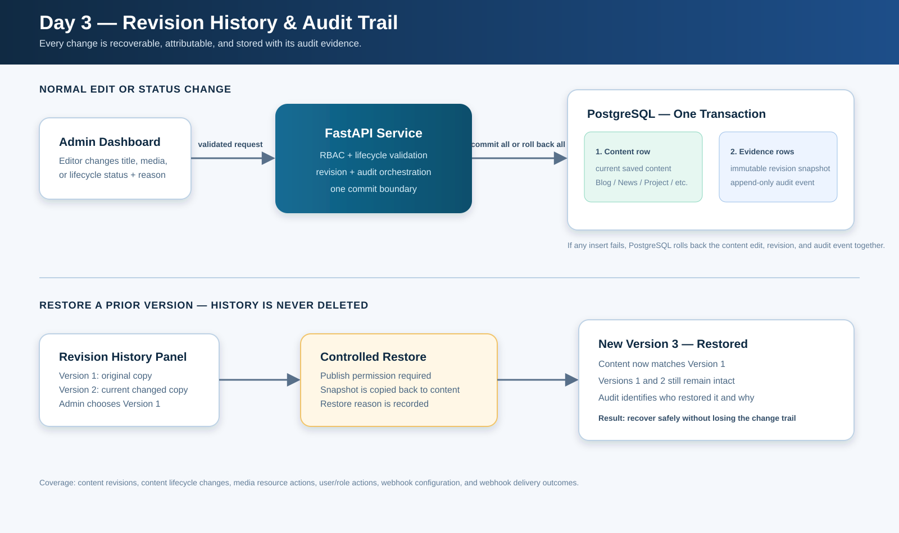

# Day 3 — Revision History, Transactions & Audit Trail

**Date:** August 5, 2026  
**Status:** Implementation complete; manual migration and verification pending.

## Purpose

Day 3 makes editorial changes recoverable and accountable. Every successful content create, edit, status change, and restore creates an immutable snapshot. The content record and its history entry are stored in the same database transaction.

## Data model

### `content_revisions`

Each revision stores `content_type`, `content_id`, sequential `version`, `action`, a complete JSON `snapshot`, changed-field names, actor id, status reason, optional source revision for restores, and a timestamp. The unique `(content_type, content_id, version)` constraint prevents duplicate version numbers.

Content that existed before Day 3 is automatically given a `baseline` snapshot immediately before its first later edit or delete. That makes its pre-edit state recoverable too.

### `audit_events`

The operational audit stream records content actions plus media-resource actions, user/role actions, webhook configuration actions, and webhook delivery outcomes. It is append-only: ordinary application code creates entries but does not edit or delete them.

## Transaction flow

Direct SVG is used instead of Mermaid so the diagram renders consistently in VS Code, GitHub, and Markdown preview tools.

## Restore safeguards

- Revision history can be viewed by editorial users with `view_drafts` permission.
- Restoring requires `publish` permission.
- A restore never erases history. It creates a new `restored` revision that points to the revision it used.
- Restore writes a new status-change actor/time/reason, preserving accountability for the restore itself.

## API

- `GET /api/v1/audit/content/{content_type}/{content_id}/revisions`
- `POST /api/v1/audit/content/{content_type}/{content_id}/revisions/{version}/restore`
- `GET /api/v1/audit/events` — super-admin operational audit stream.

## Local admin dashboard

The edit page for each of the five content types includes a Revision history panel. It lists saved versions, action, actor ID, changed fields, reason, and offers restore to users with publish permission.

## How to verify Day 3

1. Apply the migration: `.env\Scripts\python.exe -m alembic upgrade head`.
2. Run focused revision tests: `.env\Scripts\python.exe -m pytest tests\test_revision_history.py -q`.
3. Run the full regression suite: `.env\Scripts\python.exe -m pytest tests -q`.
4. Start the local backend and the admin dashboard.
5. Open an existing Blog in the dashboard, edit the title, enter a status reason if the status changes, and save.
6. Reopen the Blog. In **Revision history**, confirm there is a baseline (for older content) and a new version with the changed fields.
7. Change the title again and save. Confirm the next sequential version appears.
8. Choose the earlier version, optionally enter a restore reason, and click **Restore**. Confirm the title/content return to the earlier values.
9. Refresh the page and confirm the history now contains an additional `restored` version. Earlier versions must still be visible.
10. In Swagger, use `GET /api/v1/audit/content/blog/{id}/revisions` and, as super admin, `GET /api/v1/audit/events` to confirm the same evidence exists in the API.

## Production deployment requirement

The revision tables are created by Alembic migration `f4c7d2a9e821`. Production must run `python -m alembic upgrade head` against the Railway PostgreSQL database before the new application code handles content writes. The project start command now runs this migration before Uvicorn starts, preventing code from starting against an older schema on future deployments.

## Files delivered

- `app/models/content_revision.py`
- `app/models/audit_event.py`
- `app/services/revision_history.py`
- `app/api/v1/audit.py`
- `alembic/versions/f4c7d2a9e821_add_revision_history_and_audit_events.py`
- `tests/test_revision_history.py`
- `admin/src/components/form/RevisionHistory.tsx`
